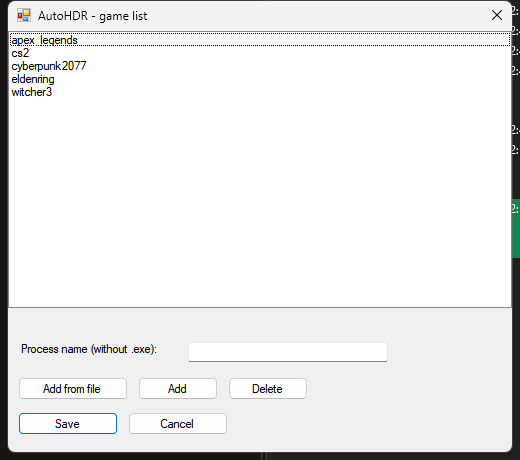
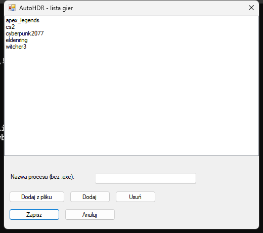

# AutoHDR

<p align="center">
  
</p>

<p align="center">
  Automatic HDR switching for games on Windows.
</p>

<p align="center">
  <a href="README.md">Wersja polska</a>
</p>

<p align="center">
  
  
</p>



The UI is available in **Polish** and **English**. You can switch the language from the tray menu.



AutoHDR runs in the background (system tray icon), detects when a game starts and automatically enables HDR on compatible monitors. When the last detected game exits, it restores the previous HDR state.

---

## Table of contents

- [Features](#features)
- [Requirements](#requirements)
- [Download](#download)
- [Installation](#installation)
- [Usage](#usage)
- [Command-line arguments](#command-line-arguments)
- [How it works](#how-it-works)
- [Building from source](#building-from-source)
- [Known limitations](#known-limitations)
- [FAQ](#faq)
- [Support](#support)
- [Acknowledgments](#acknowledgments)
- [License](#license)

---

## Features

- **Automatic HDR enable** — turns on HDR on all HDR-capable monitors when a game starts.
- **State restore** — restores the previous HDR state after the game closes.
- **Game launcher detection** — scans Steam, Epic Games, GOG, EA App, Ubisoft Connect, Battle.net, Microsoft Store and common game folders.
- **Built-in list of 800+ games** — `known_games.txt` contains popular game process names.
- **Manual game addition** — settings window lets you add your own `.exe` or process name.
- **Auto-start with Windows** — optionally launch on user logon.
- **Portable mode** — just run `AutoHDR.exe` with `known_games.txt` in the same folder.
- **.NET Framework 4.8** — runs on Windows 10/11 without a new runtime.

---

## Requirements

- Windows 10 or Windows 11
- .NET Framework 4.8 (pre-installed on recent Windows 10/11)
- An HDR-capable monitor (to actually test HDR switching)
- User permissions (no admin rights required)

---

## Download

Pre-built files are in the **[Releases](https://github.com/Zakwei/AutoHDR/releases/tag/v1.1.0)** tab.

| File | Description |
|------|-------------|
| `AutoHDR-1.1.0.msi` | Windows installer (recommended) |
| `AutoHDR-1.1.0-portable.zip` | Portable version — extract and run `AutoHDR.exe` |

---

## Installation

### MSI installer (recommended)

1. Download `AutoHDR-1.1.0.msi`.
2. Double-click and follow the wizard.
3. Launch **AutoHDR** from the Start Menu.

The installer is per-user (`%LocalAppData%\AutoHDR`) and does not require admin rights.

Uninstall: Start Menu → Settings → Apps → AutoHDR → Uninstall.

### Portable version

1. Download `AutoHDR-1.0.0-portable.zip`.
2. Extract to any folder.
3. Run `AutoHDR.exe`.

---

## Usage

After launch, an icon appears in the **system tray**.

Right-click the tray icon to:

- see current HDR state,
- refresh the detected game list,
- open the configuration folder,
- edit the game list,
- enable run on Windows startup,
- **switch language (PL / EN)**,
- exit.

### Adding a custom game

1. Select **"Edytuj listę gier"** from the menu.
2. Click **"Dodaj z pliku"** and pick the game's `.exe`, or type the process name (without `.exe`).
3. Click **"Zapisz"**.

You can also manually edit `games.txt` in the application folder — one process name per line. Lines starting with `#` are ignored.

---

## Command-line arguments

| Argument | Action |
|----------|--------|
| `AutoHDR.exe /install` or `/autostart` | Add AutoHDR to Windows startup |
| `AutoHDR.exe /uninstall` or `/noautostart` | Remove AutoHDR from Windows startup |
| `AutoHDR.exe /settings` | Open the game list editor |

---

## How it works

1. The app scans installed games from various sources and builds a set of process names to monitor.
2. Every 2 seconds it checks running processes.
3. When a matching game process is found:
   - it saves the current HDR state for each monitor,
   - enables HDR on monitors that did not already have it.
4. When the last matching game exits:
   - it restores each monitor to its pre-game state.

The app uses the Windows **DisplayConfig API** (`DisplayConfigSetDeviceInfo` / `DisplayConfigGetDeviceInfo`) to switch HDR. On Windows 11 24H2+ (build 26100+) it automatically uses the newer `DISPLAYCONFIG_SET_HDR_STATE` API.

---

## Building from source

Requirements:

- .NET SDK (for compiling, e.g. 6.0+)
- WiX Toolset v5 with `WixToolset.UI.wixext` extension (only for building the installer)

```powershell
cd AutoHDR
dotnet build AutoHDR.csproj -c Release
```

Installer:

```powershell
cd AutoHDR.Installer
.\build-installer.ps1
```

---

## Known limitations

- **Microsoft Store / Xbox Game Pass** games are detected using a publisher allow-list (`store_game_publishers.txt`). If a game is missing, add its publisher to that file and restart the app.
- Directory scanning may occasionally find a process that is not a game (false positive). You can remove it in the settings window.
- Enabling/disabling HDR can take 1–2 seconds and may cause a brief screen flicker.

---

## FAQ

### Does AutoHDR work with Xbox Game Pass / Microsoft Store games?

Yes. The app auto-detects them using the publisher allow-list in `store_game_publishers.txt`. If a game is missing, add the publisher (first segment of the package name, e.g. `king`) or add the process name manually in the **"Edytuj listę gier"** window.

### Do I need an HDR monitor?

Yes, to see the HDR switching effect. The app still works without an HDR monitor, but the log will show `wspierane=False`.

### Why did the app detect something that is not a game?

Launcher scanning may occasionally find `.exe` files that are not games. Remove them in the settings window or in `games.txt`.

### Is AutoHDR safe?

Yes. It does not require admin rights, does not send any data, and only writes files in its own folder (`AutoHDR.log`, `games.txt`).

### Does it work on Windows 10?

Yes, it requires .NET Framework 4.8, which is present on modern Windows 10 installations.

---

## Changelog

### v1.1.0 (2026-08-26)
- Automatic detection of **Microsoft Store / Xbox Game Pass** games (`store_game_publishers.txt`).
- Fixed handling of process names with spaces, parentheses and other allowed characters.
- Removed notification balloons shown when refreshing the game list.

### v1.0.0 (2026-08-25)
- Initial public release.

## Support

Have a problem? Try:

1. Check the `AutoHDR.log` file in the application folder.
2. See the [Known limitations](#known-limitations) section.
3. If that doesn't help, open an **Issue** on GitHub with a description and attach the log.

---

## Acknowledgments

The approach to HDR control was inspired by [AutoActions](https://github.com/Codectory/AutoActions) (GPL-3.0). This repository's code is written from scratch and does not include any AutoActions code.

---

## License

See [LICENSE](LICENSE).
